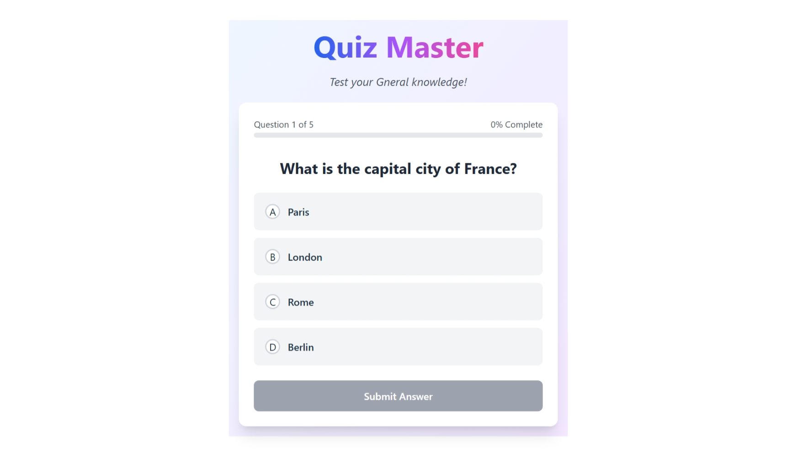
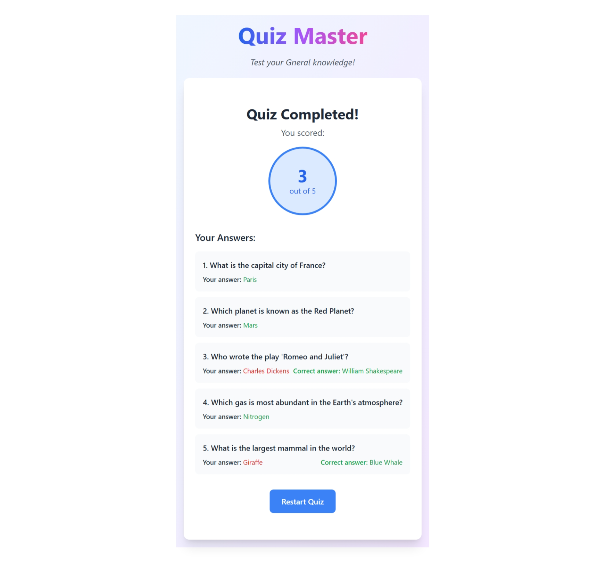

# Interactive Quiz Application

A modern, interactive quiz application built with React and Vite, featuring animations, sound effects, and a clean user interface.

## 🎯 Features

- Dynamic question rendering with smooth transitions
- Real-time feedback for answers
- Progress tracking with animated progress bar
- Sound effects for correct/incorrect answers
- Detailed results page with score analysis
- Mobile-responsive design
- Answer review system

## 📸 Screenshots

### Question Interface

*Interactive question display with multiple choice options*

### Progress Tracking

*Progress bar showing quiz completion status*

### Results Page

*Detailed score analysis and answer review*

### Working Demo video
You can also watch the demo on:
-[Drive](https://drive.google.com/file/d/1NfCtoK8ahS8Pw4JhBZtZitfM2foZM3po/view?usp=sharing)

### Live Demo

🔗 [Try the Quiz App](https://quiz-master-ivory-rho.vercel.app/)

## 🚀 Technologies Used

- React 18
- Vite
- Tailwind CSS
- Framer Motion
- Custom React Hooks
- Context API for state management

## 🛠️ Installation

1. **Clone the repository**
```bash
git clone https://github.com/Akash-Mondal2004/QuizMaster.git
```

2. **Navigate to project directory**
```bash
cd quiz-app
```

3. **Install dependencies**
```bash
npm install
```

4. **Start development server**
```bash
npm run dev
```

## 📁 Project Structure

```
quiz-app/
├── src/
│   ├── components/
│   │   ├── Quiz.jsx
│   │   └── ...
│   ├── hooks/
│   │   └── useQuiz.js
│   ├── data/
│   │   └── quizData.js
│   └── App.jsx
├── public/
│   └── sounds/
│       ├── correct.mp3
│       └── incorrect.mp3
└── screenshots/
    ├── question-interface.png
    ├── progress-tracking.png
    └── results-page.png
```

## 📝 Usage

1. Start the quiz by clicking the "Start Quiz" button
2. Select your answer from the multiple choice options
3. Submit your answer and receive immediate feedback
4. View your progress through the progress bar
5. Complete the quiz to see your final score and review answers

## 🎨 Customization

To modify quiz questions, edit the `quizData.js` file:

```javascript
export const quizData = [
  {
    question: "Your question here",
    options: ["Option 1", "Option 2", "Option 3", "Option 4"],
    correctAnswer: "Option 1"
  },
  // Add more questions...
];
```

## 🤝 Contributing

1. Fork the repository
2. Create your feature branch (`git checkout -b feature/AmazingFeature`)
3. Commit your changes (`git commit -m 'Add some AmazingFeature'`)
4. Push to the branch (`git push origin feature/AmazingFeature`)
5. Open a Pull Request


Made with ❤️ by [Akash Mondal]
